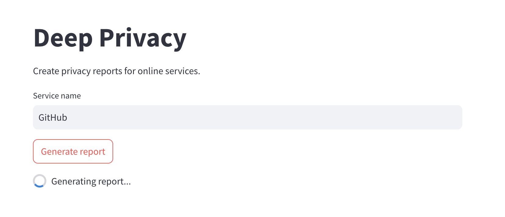

# Deep Privacy 🔒

Deep-Privacy is a tool for creating privacy reports about online tools. It uses a combination of web scraping and an LLM pipeline to autonomously search the internet for information and aggregate it into a personalized privacy report.

Once the generation is triggered, the app will start by generating a list of search queries to find relevant sources using DuckDuckGo. These URLs are then scraped and stored to a vector database. The LLM will then answer a set of predefined, generalized questions about the service based on the information found in the sources. The answers are then aggregated into the final privacy report.



## Usage

This project uses [pixi](https://pixi.sh/latest/) for dependency management.

To start off, set your OpenAI API key in <code>.env</code>.

Install dependencies:

```bash
pixi install
```

Start the UI:

```bash
pixi run ui
```

Alternatively, you can run the app in the terminal:

```bash
pixi run cli
```
